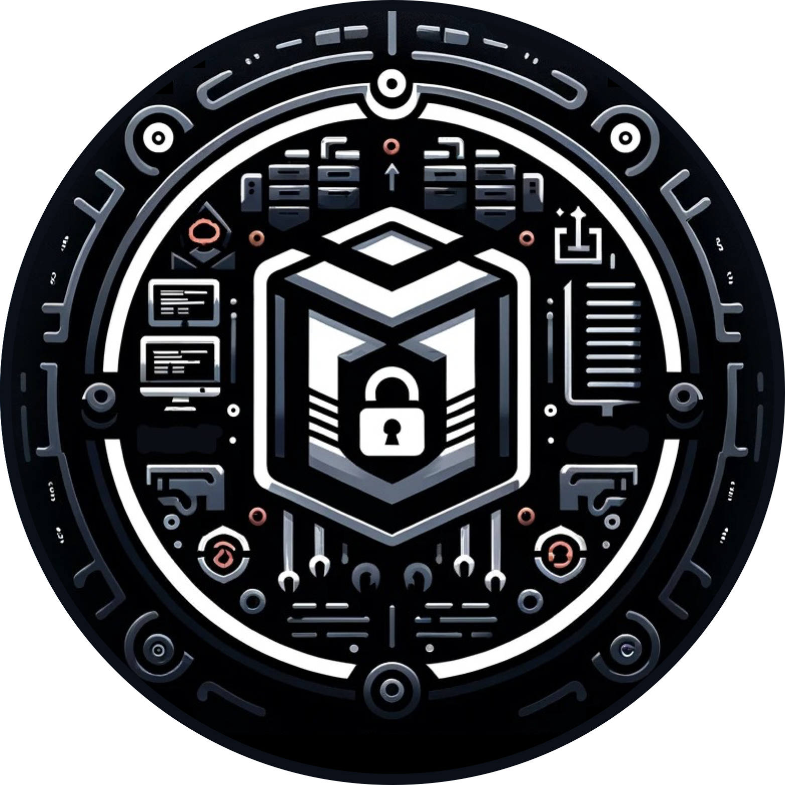

  <p align="center">
  
</p>
  
  
  <p align="center"><a href="https://github.com/ErdemOzgen/blackcart">Blackcart</a> - Continuous Automated Red Teaming/DevSecOps Dockerfile</p>
    <p align="center">
    <!-- <a href="https://github.com/erdemozgen/blackcart/actions/workflows/build-and-push.yaml" alt="Publish Docker Image">
          </a> -->
    <a href="http://doge.mit-license.org" alt="License">
          </a>
    <a href="https://hub.docker.com/r/erdemozgen/blackcart/" alt="Docker image size">
          </a>
    <a href="https://hub.docker.com/r/erdemozgen/blackcart/" alt="Docker Pulls">
          </a>
    <a href="https://www.codefactor.io/repository/github/erdemozgen/blackcart/overview/main"></a>
    <!-- <a href="https://github.com/ErdemOzgen/blackcart/actions/workflows/build-and-push.yaml/badge.svg"></a> -->
      <!-- <a href="https://github.com/ErdemOzgen/blackcart/actions/workflows/docker-publish.yml/badge.svg"></a> -->
        <a href="https://www.blackhat.com/us-24/arsenal/schedule/index.html#blackdagger-39274">
    
  </a>
  <a href="https://www.blackhat.com/sector/2024/arsenal/schedule/index.html#blackdagger-40889">
    
  </a>
  <a href="https://www.blackhat.com/eu-24/arsenal/schedule/index.html#blackdagger-41344">
    
  </a>
    <a href="https://www.blackhat.com/asia-25/arsenal/schedule/index.html#blackdagger-43296">
    
</p>

# Blackcart

Blackcart is a powerful Docker container designed for Continuous Automated Red Teaming (CART) and DevSecOps pipelines. It integrates a comprehensive suite of security tools into a containerized environment, enabling continuous security testing and proactive threat mitigation. With Blackcart, you can enhance your organization's security posture and streamline your development processes.

## Docker Container for Continuous Automated Red Teaming and DevSecOps Pipelines

Continuous automated red teaming (CART) is an advanced cybersecurity approach that incorporates automation and continuous testing into traditional red team exercises. Unlike manual red teaming conducted annually or bi-annually, CART ensures ongoing security testing throughout the year. By continuously testing an organization's cybersecurity defenses, CART aims to detect and address vulnerabilities proactively, preventing attackers from exploiting them. This method provides a more proactive and comprehensive approach to enhancing an organization's security posture. Blackcart is a streamlined Dockerfile that comprises a collection of essential security tools suitable for Continuous Automated Red Teaming (CART).

Blackcart, originally designed for CART, extends its capabilities to serve as a valuable asset in the world of DevSecOps. DevSecOps integrates security practices into the software development and delivery lifecycle, fostering a culture of security-first development.

# Blackdagger: Cyber Workflow Automation Framework
Blackdagger is a single binary tool that is capable of managing and automating complex workflows for various purposes. To improve the experience of users while using Blackdagger, various repositories that contains tested YAML files for complex workflows, easy-to-setup infrastructure for CART and DevSecOps purposes are suggested by the team. With major additions to these repositories, everything that makes Blackdagger better is collected under a framework called Blackdagger: Cyber Workflow Automation Framework.

The framework consist of 5 components:

- [**Blackdagger:**](https://github.com/ErdemOzgen/blackdagger) Core of the framework for orchestrating the components and workflows
- [**Blackcart(this repository):**](https://github.com/ErdemOzgen/blackcart) A specialized Docker container optimized for Continuous Automated Red Teaming (CART) and DevSecOps pipeline tasks.
- **Blackdagger YAMLs:** Pre-tested [example](https://github.com/ErdemOzgen/blackdagger-default) workflows, demonstrating real-world [DevSecOps](https://github.com/ErdemOzgen/blackdagger-devsecops) and [CART](https://github.com/ErdemOzgen/blackdagger-cart) use-cases, facilitating quick adoption and adaptation.
- [**Blackdagger Github Infra:**](https://github.com/ErdemOzgen/blackdagger-github-infra) A suite of advanced workflows utilizing GitHub Actions infrastructure for enhanced defense evasion techniques, scalability, and performance.
- [**Blackdagger Web Kit :**](https://github.com/ErdemOzgen/blackdagger-web-kit) A browser extension integrating all core functionalities, enabling direct interaction and execution of Blackdagger workflows from within the browser.

<p align="center">
  
</p>

Each component is compatible with each other to run on **any environment, for any case and as easy, fast and effective as possible.** The framework also enables adding, removing or modifying components to add extra features for new purposes.


# Highlights
- Continuous Automated Red Teaming (CART)
- DevSecOps abilities
- Continuous security testing
- Vulnerability assessment
- Threat detection
- Automation and orchestration
- Compliance and reporting
- Streamlined Docker container
- Comprehensive toolset
- Integration with DevSecOps pipelines

# Installation and Usage
The only requirement for installation is Docker.

Simply clone this repository or download the release package.
Go to the directory and run:

```bash
docker compose up 
```

You can access GoTTY web terminal from http://127.0.0.1:8090.

Default username: blackcart 
Default password: blackcart

You can perform any actions just like your UNIX-based security machine on this web terminal.

From http://127.0.0.1:8080, you can also access the UI of [Blackdagger](https://github.com/ErdemOzgen/blackdagger), which is a YAML based automation tool for Continuous Red Teaming, DevSecOps, MLSecOps and more.

# Features

## DevSecOps with Blackcart

Blackcart's rich arsenal of security tools and its containerized environment make it an ideal candidate for DevSecOps pipelines. Here's how Blackcart can contribute to your DevSecOps practices:

### 1. Continuous Security Testing

Blackcart enables continuous security testing of your applications and infrastructure. Incorporate it into your CI/CD pipelines to automatically scan for vulnerabilities, misconfigurations, and potential threats, ensuring that security remains a top priority throughout the development process.

### 2. Vulnerability Assessment

Utilize Blackcart's extensive toolkit to perform vulnerability assessments on your code, dependencies, and infrastructure components. Identify and remediate vulnerabilities early in the development cycle, reducing the risk of security breaches.

### 3. Threat Detection

Leverage Blackcart's security tools to detect and analyze threats in real-time. Monitor for suspicious activities and potential security incidents, allowing for immediate response and mitigation.

### 4. Automation and Orchestration

Integrate Blackcart into your automation and orchestration workflows. Automate security scans, tests, and compliance checks, enabling rapid feedback and ensuring that security is an integral part of your development and deployment processes.

### 5. Compliance and Reporting

Generate comprehensive security reports and compliance documentation using Blackcart's tools. Streamline the auditing process and demonstrate compliance with industry standards and regulations.

Incorporating Blackcart into your DevSecOps pipelines enhances your organization's ability to build and deploy secure applications while fostering a proactive security culture. It's not just about Continuous Automated Red Teaming; it's about empowering DevSecOps practices for a more secure digital future.

In addition to these capabilities, you can use [Blackdagger](https://github.com/ErdemOzgen/blackdagger), our YAML based automation tool integrated in Blackcart to perform your DevSecOps tasks. With Blackdagger, you can benefit from its automation abilities and easiness to perform DevSecOps tasks with its user-friendly Web UI and [YAML collection with various features](https://github.com/ErdemOzgen/blackdagger-devsecops).

## CART with Blackcart
Beyond DevSecOps, Blackcart serves as a versatile platform that empowers cybersecurity professionals with an extensive toolkit and advanced capabilities. With Blackcart, users can transform any device into a comprehensive cybersecurity testing environment, equipped with tools for advanced threat hunting, incident response planning, and forensic analysis. Blackcart facilitates proactive security measures by enabling users to conduct thorough vulnerability assessments, real-time threat detection, and compliance monitoring. 

In addition to these capabilities, you can use [Blackdagger](https://github.com/ErdemOzgen/blackdagger), our YAML based automation tool integrated in Blackcart to perform your CART tasks. With Blackdagger, you can benefit from its automation abilities and easiness to perform CART actions with its user-friendly Web UI and [YAML collection with various features](https://github.com/ErdemOzgen/blackdagger-cart).

## Transform a device into a platform for cybersecurity professionals

Blackcart serves as a transformative platform, equipping any device with the comprehensive capabilities needed by cybersecurity professionals with the help of containerization technology. By leveraging Blackcart, cybersecurity professionals can effectively fortify their organization's defenses, proactively identifying and addressing potential vulnerabilities while streamlining security processes with a very small effort and hardware and software resources.

# What Sets Blackcart Apart?
## Streamlined Docker Container
Blackcart provides a containerized environment with pre-configured security tools, simplifying setup and deployment for users. Its Dockerized architecture ensures consistency and portability across different environments.

## Comprehensive Toolset
With an extensive collection of security tools, Blackcart caters to diverse testing scenarios. From vulnerability scanning to threat detection, Blackcart offers a holistic approach to security testing.

## Integration with DevSecOps Pipelines
Blackcart seamlessly integrates into DevSecOps practices, enabling organizations to incorporate security into the software development lifecycle. By automating security testing and compliance checks, Blackcart facilitates the adoption of a security-first mindset.

# Installed Tools


| Name               | Description                                  |
| ------------------ | -------------------------------------------- |
| git                | Version control system                       |
| python             | Programming language                         |
| python-pip         | Python package manager                       |
| go                 | Programming language                         |
| nmap               | Network exploration tool                     |
| nuclei             | Fast and customizable vulnerability scanner  |
| rustscan           | Fast port scanner                            |
| zmap               | Network scanner for open ports               |
| amass              | Subdomain enumeration tool                   |
| gau                | Fetch known URLs from AlienVault's OTX      |
| traceroute         | Network diagnostic tool                      |
| sslscan            | SSL/TLS security testing tool                |
| massdns            | DNS resolver and list generator              |
| altdns             | Subdomain permutation tool                   |
| httprobe           | HTTP/HTTPS probe                             |
| masscan            | Fast port scanner                            |
| hosthunter         | Subdomain discovery tool                     |
| gobuster           | Directory/file brute-forcing tool            |
| dirsearch          | Web path scanner                             |
| hydra              | Password cracking tool                       |
| gospider           | Web spider and crawler                       |
| xsstrike           | XSS scanner                                  |
| ssrf-sheriff       | Server-Side Request Forgery (SSRF) scanner   |
| ssrfmap            | Server-Side Request Forgery (SSRF) scanner   |
| corscanner         | CORS misconfiguration scanner                |
| crlfuzz            | CRLF injection vulnerability scanner         |
| sqlmap             | SQL injection scanner                        |
| wget               | Network utility to retrieve files            |
| net-tools          | Network configuration tools                  |
| jq                 | Command-line JSON processor                  |
| aws-cli            | AWS Command Line Interface                   |
| wfuzz              | Web application brute-forcing tool           |
| arjun              | Parameter-based request tool                 |
| theharvester       | Information gathering tool                   |
| assetfinder        | Subdomain finder tool                        |
| orunmila           | DNS brute-forcing tool                       |
| cspparse           | Content Security Policy (CSP) parser         |
| certnames          | Extract SSL/TLS certificate names            |
| sniprobe           | Subdomain enumeration tool                   |
| harx               | HTTP Archive (HAR) file extractor            |
| subfinder          | Subdomain discovery tool                     |
| notify             | Notification service for security findings   |
| httpx              | Fast and multi-purpose HTTP scanner         |
| jre11-openjdk      | Java Runtime Environment 11                  |
| jdk11-openjdk      | Java Development Kit 11                      |
| Shodan             | Internet-wide network scanning tool           |
| Censys             | Internet-wide network scanning tool           |
| Go-dork       | The fastest dork scanner written in Go. including Google, Shodan, Bing, Duck, Yahoo and Ask.                     |
| Gitleaks           | Tool for finding sensitive information in Git repositories |
| Favicon            | Extracts favicon URLs from websites crosssearch with shodan          |
| WaybackURLs        | Tool to discover archived web pages          |
| XSS Striker        | XSS scanner                                  |
| IIS Shortname Scanner | Scanner for IIS short filename disclosure |
| JSLeak             | JavaScript link finder tool                  |
| Smuggler           | HTTP request smuggling scanner               |
| [WebAnalyzer](https://github.com/ErdemOzgen/WAP_API)        | Website analysis tool  (Not in Blackcart, you can use it as a different Docker container)  |
| wapiti             | Comprehensive web app vulnerability scanner written in Python |
| nano               | GNU nano is a small editor for on the terminal |
| Dalfox             | Powerful open-source XSS scanner and utility focused on automation |
| S3scanner          | Scan for misconfigured S3 buckets across S3-compatible APIs |
| [Blackdagger](https://github.com/ErdemOzgen/blackdagger)        | YAML based automation tool for Continuous Red Teaming, DevSecOps, MLSecOps and more|
| Puredns   | A DNS resolution and permutation tool designed for performing mass DNS queries efficiently.  |
| Hakrawler | A web crawler designed for the discovery of endpoints and assets within web applications.     |
| Dnsprobe  | A tool for querying DNS records with support for various types, useful for reconnaissance.    |
| Qsreplace | A utility to quickly and easily replace query string parameters in URLs for testing.          |
| Anew      | A simple tool for adding new lines to files, avoiding duplicates, useful for data de-duping.  |
| Gf        | A tool designed to make file discovery easier by allowing users to create custom grep aliases for complex patterns. |
| Parallel  | A shell tool for executing jobs in parallel, optimizing resource usage and time efficiency.   |
| Uro       | This tool might not be widely recognized as the others. Please ensure the name is correct or provide a description if it's a specific utility within a similar domain. |

# Contribution
Whether you're a seasoned expert or just starting out, there are many ways you can contribute to the Blackcart project:

Share Your Ideas: Have a suggestion for a new feature, tool, or improvement? We'd love to hear it! Share your ideas with us and help shape the future of Blackcart.

Add New Tools and Features: Is there a tool or feature you'd like to see in Blackcart? You can help expand the platform's capabilities by contributing new tools, integrations, or enhancements.

Ask Questions: Got a question about how to use Blackcart or need help troubleshooting an issue? Don't hesitate to ask! We are here to support you every step of the way.

Report Issues: Encountered a bug or unexpected behavior? Let us know by submitting an issue on GitHub. Your feedback helps us identify and address issues promptly.

Submit Pull Requests: Want to contribute code to the project? We welcome contributions of all sizes! Whether it's adding a new tool, fixing a bug, or improving documentation, your contributions make a difference.

Feel free to contribute in any way you want! Share ideas, questions, submit issues, and create pull requests.
We welcome any and all contributions!

# License

This project is licensed under the [MIT License](LICENSE).
